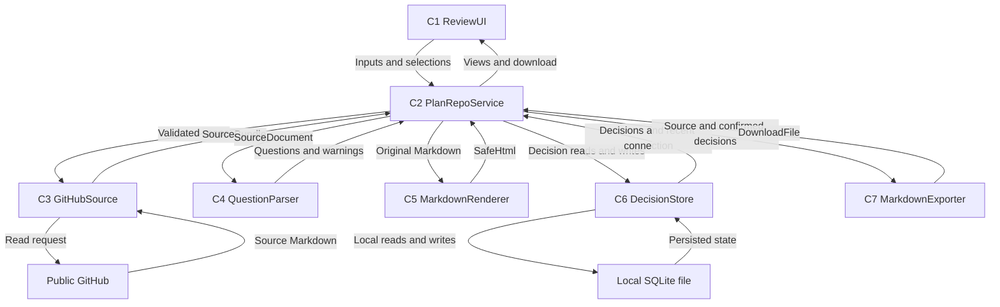

# PlanRepo MVP 애플리케이션 설계

## 검토 요약

- 상태: 2026-09-08 사용자 재개 요청으로 Application Design 승인 완료.
- 범위: 로컬 단일 사용자 웹 앱 하나, SQLite 파일 하나, 공개 GitHub 읽기만 사용.
- 핵심 결정: 하나의 PlanRepoService가 5개 전문 모듈을 조정하고 ReviewUI에 결과를 전달한다. 총 7개 논리 구성 요소는 하나의 `planrepo` 구현 단위에 속한다.
- 확정 답변만 SQLite에 저장하고 Markdown 다운로드에 반영한다. 선택 중인 답변은 화면의 임시 상태다.
- 원문·파싱 결과를 같은 조회 컨텍스트에 연결한다. 표시용 HTML은 저장·내보내기의 원문으로 사용하지 않는다.
- 구현 언어·프레임워크, SQL 스키마, 질문 식별 알고리즘은 이 단계에서 고정하지 않는다.

이 문서는 구성 요소, 메서드, 서비스 흐름, 의존성 문서를 한곳에 모은 통합본이다. 구성 요소별 원본은 [components.md](components.md), [component-methods.md](component-methods.md), [services.md](services.md), [component-dependency.md](component-dependency.md)다.

## PlanRepo 구성 요소

### 구조 원칙

브라우저 UI와 로컬 애플리케이션 프로세스 하나, SQLite 파일 하나로 구성한다. 아래 7개 구성 요소는 같은 `planrepo` 단위 안의 논리 책임이며 별도 서비스·패키지·클래스 생성을 강제하지 않는다. UI와 서비스 경계의 HTTP 경로 및 구체적인 언어·라이브러리는 후속 설계에서 정한다.

| ID | 구성 요소 | 목적과 책임 | 제공 인터페이스 | 요구사항 |
| --- | --- | --- | --- | --- |
| C1 | ReviewUI | 연결 입력, 문서 목록·열람, 대기열, 임시 답변 선택, 일괄 확정, 문서별 다운로드와 오류 표시 | 사용자 이벤트 처리, WorkspaceView·DocumentView 표시 | FR-1~FR-6 |
| C2 | PlanRepoService | 입력과 조회 컨텍스트 검증, 문서 로드·질문 추출·저장 결정 병합, 일괄 확정 및 내보내기 조정 | 초기화, 연결, 문서 조회, 대기열 조회, 답변 확정, 내보내기 | FR-1~FR-6 |
| C3 | GitHubSource | 허용된 공개 GitHub 저장소의 기본 브랜치와 지정 폴더 아래 Markdown 읽기, 접근 오류 변환 | 연결 정보 정규화, 문서 집합 로드 | FR-1, FR-2 |
| C4 | QuestionParser | 원문에서 질문·선택지·현재 답변과 답변 위치를 추출, 잘못된 영역에 경고 부여 | 원문 파싱 | FR-3 |
| C5 | MarkdownRenderer | 원문을 안전하게 표시 가능한 HTML로 변환 | 안전한 HTML 렌더링 | FR-2 |
| C6 | DecisionStore | 최근 연결, 문서별 질문 식별자·선택 답변·결정 시각을 SQLite에 영속화 | 최근 연결 조회·저장, 결정 조회, 일괄 저장 | FR-5, FR-6 |
| C7 | MarkdownExporter | 확정 답변을 원문의 해당 답변 위치에 반영하여 다운로드 결과 생성 | 문서별 Markdown 생성 | FR-5 |

### 책임 경계

- C1은 원문에서 질문을 독자적으로 파싱하거나 SQLite·GitHub에 직접 접근하지 않는다. 텍스트는 텍스트로 표시하고 본문에는 C5의 안전한 HTML만 사용한다.
- C2는 현재 로드된 문서 집합을 관리한다. 질문 선택값을 원문과 대조하고, 저장된 결정을 적용할 수 있는지 판단하는 책임을 가진다.
- C3만 GitHub 읽기 요청을 보낸다. 사용자 입력은 요청 전에 검증하며 원격 쓰기 인터페이스는 제공하지 않는다.
- C4와 C7은 입력 원문을 기준으로 동작한다. DB나 네트워크에 접근하지 않는다. C7은 HTML을 Markdown으로 역변환하지 않는다.
- C5는 표시를 위한 변환만 담당한다. 파싱·저장·내보내기에 쓰이는 원문은 그대로 유지한다.
- C6만 SQLite를 접근한다. 저장 성공이 확인된 뒤 C2가 완료 상태를 반환한다.

### 상태의 소유권

| 상태 | 소유자 | 수명 |
| --- | --- | --- |
| 선택 문서와 미확정 답변 | C1 | 현재 화면 작업 동안 |
| 읽어 온 문서 원문·버전 정보·파싱 결과 | C2 | 현재 로컬 프로세스의 활성 문서 조회 컨텍스트 |
| 최근 연결 정보, 확정 답변·결정 시각 | C6 | 재시작 후에도 유지되는 SQLite 파일 |
| 안전한 HTML 및 다운로드 내용 | C5·C7이 생성, C2가 전달 | 표시 또는 다운로드 요청 결과 |

문서 원문 전체의 영속 캐시는 요구하지 않는다. 재시작 후 C6에서 최근 연결 정보를 복원하고 공개 저장소 문서를 다시 읽어 저장 결정을 연결한다. 오프라인 문서 열람은 MVP 완료 조건이 아니다.

## PlanRepo 구성 요소 메서드와 계약

### 표기

아래는 언어에 독립적인 개념적 메서드다. `List[T]`는 목록, `Optional[T]`는 값 없음 허용, `Result[T]`는 성공값 또는 `AppError`다. 실제 함수·HTTP 경로·직렬화는 후속 단계에서 정한다.

### 공유 입출력 타입

| 타입 | 의미와 주요 필드 |
| --- | --- |
| DocumentKey / QuestionKey / SnapshotId | 서버가 검증하는 문서 식별자, 질문 식별자, 활성 조회 컨텍스트 식별자 |
| SafeHtml / Warning | 안전한 렌더링 결과 문자열, 문서·위치·사용자 메시지를 가진 파싱 경고 |
| ConnectionInput | 사용자가 입력한 저장소 URL, 문서 폴더 경로 |
| RepositoryScope | 검증·정규화된 저장소 식별자와 폴더 경로 |
| SourceDocument | 저장소·경로를 포함하는 DocumentKey, 원문 Markdown, 원문 버전 정보 |
| SourceBundle | RepositoryScope, 기본 브랜치 조회 정보, 지정 폴더 아래 SourceDocument 목록 |
| ParsedQuestion | QuestionKey, 문서 식별, 질문 문구, 선택지 문자·내용, 원문 답변, 답변 위치와 원문 연결 정보 |
| ParseResult | 유효한 ParsedQuestion 목록과 문서 위치를 포함한 Warning 목록 |
| SavedDecision | QuestionKey, 선택 문자, 결정 시각, 원문 연결 검증 정보 |
| AnswerSelection | QuestionKey와 선택 문자; 결정 시각과 원문 위치는 클라이언트가 정하지 않음 |
| ReviewContext | SnapshotId, SourceBundle 및 문서별 ParseResult를 가진 서버 내부 조회 컨텍스트 |
| WorkspaceView | SnapshotId, 연결 정보, 문서 요약 목록, 미결정 질문 목록, 경고 |
| DocumentView | DocumentKey, 안전한 HTML, 해당 문서의 질문별 결정 상태와 경고 |
| CommitResult | 저장된 결정 목록 및 저장 결과를 반영한 WorkspaceView |
| DownloadFile | 파일명, Markdown 내용, 다운로드 콘텐츠 유형 |
| AppError | 안정적인 오류 구분값, 사용자 메시지, 사용자가 다시 시도할 수 있는지 여부; 내부 스택은 포함하지 않음 |

DocumentKey는 저장소와 문서를, QuestionKey는 문서 내 질문을 구분하는 불투명 식별자다. SnapshotId는 한 번 읽은 원문 집합을 구분하는 임시 핸들이며 인증 토큰이 아니다. 실제 식별자 생성·원문 변경 처리·위치 단위는 Functional Design에서 확정한다.

### C1 ReviewUI

| 메서드 | 목적 |
| --- | --- |
| `initialize() -> Result[Optional[ConnectionInput]]` | 최근 연결 정보를 받아 입력란 표시 |
| `connect(input: ConnectionInput) -> Result[WorkspaceView]` | 연결 제출 후 문서와 대기열 표시 |
| `openDocument(document: DocumentKey) -> Result[DocumentView]` | 활성 SnapshotId와 문서로 열람 요청 |
| `selectAnswer(question: QuestionKey, option: String) -> Void` | 현재 화면의 임시 선택 갱신 |
| `confirmAnswers() -> Result[CommitResult]` | 활성 SnapshotId와 임시 선택 목록 제출; 성공 후 반영 |
| `downloadDocument(document: DocumentKey) -> Result[DownloadFile]` | 확정 결과가 반영된 문서 내려받기 |

### C2 PlanRepoService

| 메서드 | 목적 |
| --- | --- |
| `getRecentConnection() -> Result[Optional[ConnectionInput]]` | C6에서 최근 연결 복원 |
| `connect(input: ConnectionInput) -> Result[WorkspaceView]` | C3 검증·읽기, C4 파싱, C6 결정 조회 후 ReviewContext 구성 |
| `getWorkspace(snapshot: SnapshotId) -> Result[WorkspaceView]` | 활성 컨텍스트와 저장 결정으로 대기열·문서 요약 반환 |
| `getDocument(snapshot: SnapshotId, document: DocumentKey) -> Result[DocumentView]` | 활성 원문을 C5로 렌더링하고 질문별 상태 전달 |
| `commitAnswers(snapshot: SnapshotId, selections: List[AnswerSelection]) -> Result[CommitResult]` | 질문·선택값 검증, 결정 시각 설정, C6 일괄 저장 후 상태 반환 |
| `exportDocument(snapshot: SnapshotId, document: DocumentKey) -> Result[DownloadFile]` | 컨텍스트 원문과 호환되는 C6의 확정 결정만 C7에 전달 |

### C3 GitHubSource

| 메서드 | 목적 |
| --- | --- |
| `validateConnection(input: ConnectionInput) -> Result[RepositoryScope]` | 네트워크 요청 전에 URL·폴더 입력 검증 및 정규화 |
| `loadMarkdown(scope: RepositoryScope) -> Result[SourceBundle]` | 공개 저장소 기본 브랜치의 지정 폴더 아래 Markdown 집합 읽기 |

폴더가 존재하지만 Markdown이 없는 결과는 빈 SourceBundle로 표현하고, 폴더 접근 실패는 AppError로 구분한다. 폴더 탐색 방법, 하위 경로 처리와 GitHub 요청 상세는 구현 전에 구체화한다.

### C4 QuestionParser

| 메서드 | 목적 |
| --- | --- |
| `parse(document: SourceDocument) -> ParseResult` | 질문·선택지·답변과 위치 정보 추출; 잘못된 영역은 경고와 함께 처리 |

### C5 MarkdownRenderer

| 메서드 | 목적 |
| --- | --- |
| `render(markdown: String) -> Result[SafeHtml]` | 위험한 HTML·스크립트가 실행되지 않는 본문 생성 |

### C6 DecisionStore

| 메서드 | 목적 |
| --- | --- |
| `getRecentConnection() -> Result[Optional[ConnectionInput]]` | 저장된 최근 연결 읽기 |
| `saveRecentConnection(input: ConnectionInput) -> Result[Void]` | 검증되고 읽기에 성공한 연결 정보 저장 |
| `listDecisions(documents: List[DocumentKey]) -> Result[List[SavedDecision]]` | 해당 저장소·문서들의 기존 결정 조회 |
| `saveDecisions(decisions: List[SavedDecision]) -> Result[List[SavedDecision]]` | 하나의 확정 동작을 SQLite 트랜잭션으로 저장 |

SQLite 파일 열기·초기화 및 스키마는 코드 생성 전에 정의한다. 이 저장 인터페이스의 오류는 AppError로 전달하며 저장되지 않은 값을 완료로 응답하지 않는다.

### C7 MarkdownExporter

| 메서드 | 목적 |
| --- | --- |
| `export(document: SourceDocument, parsed: ParseResult, decisions: List[SavedDecision]) -> Result[DownloadFile]` | 검증된 답변 위치에 확정 답변을 반영하고 문서 한 개의 다운로드 생성 |

### 공통 계약

- UI가 제공하는 문서·질문 식별자는 활성 ReviewContext에 속하는지 C2에서 검증한다. 클라이언트 원문 위치와 SQL은 받지 않는다.
- 유효하지 않거나 만료된 SnapshotId는 다시 연결할 수 있는 오류로 반환한다. 재시작 후 저장 결정은 새 컨텍스트에 다시 연결한다.
- C2는 저장 후보를 전부 검증한 뒤 C6을 호출하며, C6은 일괄 저장 전체가 성공한 경우에만 성공을 반환한다.
- 파싱 경고와 사용자에게 표시할 일반 오류를 구분한다. 저장 실패 시 임시 선택을 화면에 남겨 사용자가 다시 확정할 수 있게 한다.
- 상세 문법, 중복 번호 처리, 저장 결정과 원문 답변의 우선순위, 원문 변경 판정은 Functional Design에서 정의한다.

## PlanRepo 애플리케이션 서비스

### 서비스 정의

**PlanRepoService(C2)** 하나가 사용자 여정의 조정을 맡는다. C3~C7은 전문 역할을 수행하는 같은 프로세스의 모듈이다. 서비스 간 메시지 큐, 백그라운드 동기화, 외부 배포 서비스는 필요하지 않다.

### 연결과 문서 로드

1. C1은 최근 연결 입력을 C2에서 받아 보여준다. 사용자가 연결을 제출하면 C2는 C3의 `validateConnection`을 호출한다.
2. C3은 검증된 저장소 기본 브랜치의 지정 폴더 아래 Markdown을 `loadMarkdown`으로 읽는다. 조회 원문과 버전 정보를 함께 반환한다.
3. C2는 각 원문을 C4에 전달하여 질문과 경고를 얻는다. 형식이 잘못된 영역이 있어도 나머지 유효 질문을 유지한다.
4. C2는 문서별 저장 결정을 C6에서 조회하고 현재 질문과 연결 가능한 결정만 적용한다.
5. C2는 최근 연결을 C6에 저장하고 ReviewContext를 활성화한 뒤 전체 문서의 미결정 질문을 포함한 WorkspaceView를 반환한다.

조회 중 네트워크 오류로 문서 집합을 완성하지 못한 경우 이를 완전한 빈 대기열처럼 표시하지 않는다. 연결 시도 실패를 알리고 다시 시도할 수 있게 한다. 폴더가 존재하지만 Markdown이 없으면 정상 빈 목록을 표시한다.

### 문서 열람과 대기열

- C1은 활성 SnapshotId 및 DocumentKey를 전달한다. C2는 해당 원문을 C5로 렌더링하여 안전한 HTML과 질문 상태를 반환한다.
- 전체 대기열은 C2의 파싱 결과와 호환되는 저장 결정으로 계산한다. 브라우저가 질문 원문을 재파싱하지 않는다.
- 본문은 조회한 원문을 보여주며 로컬 확정 상태는 질문 상태·대기열에 반영한다. 다운로드 결과는 확정 답변이 반영된 Markdown이다.
- `getWorkspace`는 현재 컨텍스트의 상태를 반환한다. 외부 저장소의 새 원문은 사용자의 재연결 시 읽으며 실시간 동기화를 도입하지 않는다.

### 답변 선택과 일괄 확정

1. 선택 변경은 C1의 임시 상태만 바꾼다.
2. 확정 시 C2는 활성 컨텍스트, 대상 질문과 선택지를 검증한다.
3. C2는 결정 시각과 원문 연결 정보를 포함한 SavedDecision 목록을 만들고 C6에 전달한다.
4. C6은 한 트랜잭션으로 저장한다. 성공하면 C2가 갱신된 WorkspaceView와 저장 결과를 반환한다.
5. C1은 성공한 확정 결과를 반영하고 해당 임시 선택을 비운다. 실패 시 완료 표시를 하지 않고 임시 선택과 오류를 유지한다.

트랜잭션의 구체적인 SQL과 중복 선택·재확정 규칙은 Functional Design에서 정한다.

### 재시작과 동일 문서 재조회

C6의 파일 기반 데이터는 유지된다. 앱 재시작 후 최근 연결 입력을 복원하고, 다시 읽은 문서의 질문에 저장된 결정을 연결한다. 메모리에 있던 SnapshotId를 영속 식별자로 사용하지 않는다. 원문이 변경된 경우 자동 연결할 수 있는 조건은 Functional Design에서 확정한다.

### Markdown 내보내기

1. C2가 요청한 문서의 활성 원문·파싱 결과를 찾고 C6에서 확정 결정을 조회한다.
2. C2가 원문에 연결 가능한 결정만 선별하여 C7에 전달한다. 화면의 미확정 선택은 전달하지 않는다.
3. C7이 원문의 답변 위치를 수정하여 문서 한 개의 DownloadFile을 만든다. 그 외 원문은 보존한다.
4. C1이 파일을 내려받는다. 이 흐름은 C3을 호출하지 않으며 원격 저장소를 수정하지 않는다.

여러 문서의 답변도 한 번에 확정할 수 있지만 다운로드는 선택한 문서별로 수행한다. ZIP 일괄 다운로드는 요구하지 않는다.

### 오류와 검증 책임

| 상황 | 감지 책임 | 사용자에게 전달할 결과 |
| --- | --- | --- |
| 잘못된 URL·폴더 입력 | C3, C2 | 요청 전 입력 오류 |
| 접근 불가·존재하지 않는 폴더·네트워크·요청 한도 | C3 | 원인을 이해하고 다시 시도할 수 있는 읽기 오류 |
| 잘못된 질문 영역 | C4 | 원본 위치와 경고, 다른 유효 질문은 유지 |
| 만료된 컨텍스트·잘못된 문서/질문/선택값 | C2 | 재연결 또는 올바른 선택을 안내하는 오류 |
| SQLite 저장 실패 | C6, C2 | 저장 실패, 미확정 선택 유지 |
| 원문과 답변 위치 불일치 | C2, C7 | 잘못된 파일을 생성하지 않고 재조회 안내 |
| 렌더링 처리 실패 | C5, C2 | 안전한 오류 표시; 원문을 위험한 HTML로 직접 출력하지 않음 |

외부·저장 계층 오류를 사용자 오류로 변환하는 경계는 각 구성 요소와 C2다. UI 응답에는 내부 스택이나 SQL을 포함하지 않는다.

## PlanRepo 의존성과 데이터 흐름

### 직접 의존성 표

행은 호출자, 열은 호출 대상이다. `X`는 직접 호출, `-`는 직접 호출 없음이다.

| 호출자 | C1 UI | C2 Service | C3 GitHub | C4 Parser | C5 Renderer | C6 Store | C7 Exporter |
| --- | --- | --- | --- | --- | --- | --- | --- |
| C1 UI | - | X | - | - | - | - | - |
| C2 Service | - | - | X | X | X | X | X |
| C3 GitHub | - | - | - | - | - | - | - |
| C4 Parser | - | - | - | - | - | - | - |
| C5 Renderer | - | - | - | - | - | - | - |
| C6 Store | - | - | - | - | - | - | - |
| C7 Exporter | - | - | - | - | - | - | - |

C3만 외부 GitHub에 읽기 요청을 보내고 C6만 SQLite에 접근한다. C7은 C4를 직접 호출하지 않고 C2가 전달하는 ParseResult를 사용한다. 공통 데이터 타입은 특정 UI·저장 모듈에 의존하지 않는다.

### 통신 방식

- C1 ↔ C2: 브라우저와 로컬 앱 사이의 요청·응답. 구체적인 HTTP 경로와 형식은 스택 선택 후 확정한다.
- C2 ↔ C3~C7: 같은 프로세스의 함수 호출과 결과 반환. 네트워크·DB 작업의 실제 비동기 문법은 언어 선택에 따른다.
- C3 ↔ GitHub: 허용된 GitHub 읽기 경로만 사용하는 요청·응답. 토큰을 수집하지 않는다.
- C6 ↔ SQLite: 로컬 파일 읽기·쓰기, 답변 일괄 확정은 트랜잭션으로 처리한다.

### 데이터 흐름도

화살표는 데이터가 이동하는 방향이다. 외부 시스템과 SQLite를 제외한 C2~C7은 로컬 앱 프로세스 안에 있다.

#### 텍스트 대안

연결 입력은 UI → Service → GitHubSource → GitHub 순서로 전달된다. 원문은 역방향으로 돌아와 Service → Parser의 질문 추출과 Service → Renderer의 열람에 사용된다. Service ↔ Store ↔ SQLite가 최근 연결과 확정 답변을 유지한다. 내보내기는 Service → Exporter → Service → UI 순서로 원문과 확정 결정을 다운로드 파일로 변환한다.

### 결합과 일관성

- 직접 호출 의존성은 C1 → C2 → C3~C7 방향이며 순환하지 않는다. 데이터 흐름도의 응답 화살표는 역방향 호출 의존성을 의미하지 않는다.
- Service가 같은 ReviewContext의 원문과 파싱 결과를 사용하게 하여 렌더링·대기열·내보내기의 원문 기준을 맞춘다.
- 모든 문서의 결정 조회와 저장은 저장소·문서 범위를 포함한다. 다른 저장소의 같은 질문 번호를 같은 결정으로 취급하지 않는다.
- 테스트는 C3 읽기 경계와 C6 파일 저장을 통과하는 핵심 사용자 흐름에 집중한다. 이 설계 때문에 별도 단위 테스트 모음이나 부하 테스트를 추가하지 않는다.

## 요구사항과 사용자 스토리 추적성

| 요구사항 | 스토리 | 주된 설계 책임 | 핵심 확인 결과 |
| --- | --- | --- | --- |
| FR-1 공개 GitHub 연결 | US-01 | C1, C2, C3 | 요청 전 검증, 기본 브랜치·폴더 읽기, 사용자 오류 |
| FR-2 문서 탐색·열람 | US-01, US-02 | C1, C2, C3, C5 | Markdown 목록과 안전한 본문 표시 |
| FR-3 질문 추출 | US-03 | C2, C4 | 유효 질문·선택지·원문 답변·위치·경고 |
| FR-4 미결정 대기열 | US-03, US-04 | C1, C2, C4, C6 | 모든 문서의 미결정 질문, 선택·확정 후 상태 갱신 |
| FR-5 답변 저장·내보내기 | US-04, US-05 | C1, C2, C6, C7 | 트랜잭션 저장, 확정 답변의 원문 반영, 원격 쓰기 없음 |
| FR-6 최소 상태 관리 | US-04, US-05 | C2, C6 | 최근 연결·문서별 질문 식별·선택·결정 시각 영속화와 재조회 연결 |

P-01 로컬 문서 검토자가 모든 사용자 흐름을 사용한다. 인증·다중 사용자·원격 수정·외부 배포·성능·확장성·고가용성·복원력 설계는 포함하지 않는다. 검증은 향후 핵심 경로 스모크 테스트로 제한한다.

## 후속 단계에서 구체화할 결정

다음 항목은 예정된 상세 설계 작업이며 현재 단계의 누락된 사용자 답변이 아니다.

| 결정 | 책임 단계 | 적용할 상위 조건 |
| --- | --- | --- |
| 구성 요소·스토리의 구현 단위 매핑 | Units Generation | `planrepo` 단위 하나, 전 스토리 포함 |
| 질문 문법, 코드 블록 경계, 중복 번호, 답변 위치 | Functional Design | 기본 AI-DLC 형식 지원, 잘못된 영역 경고, 원문 보존 |
| 문서·질문 키와 원문 변경 시 결정 연결 조건 | Functional Design | 동일 문서 재조회에서 유지, 다른 질문으로 오연결 금지 |
| 원문 답변과 로컬 답변의 적용 우선순위 | Functional Design | 결정 완료 상태를 정확히 분류하고 확정 결과를 일관되게 내보내기 |
| SQLite 테이블·키와 일괄 저장 검증 | Functional Design | 최근 연결·선택 답변·결정 시각 유지, 원자적 확정 |
| 언어, 웹 프레임워크, Markdown 처리와 SQLite 접근 라이브러리 | NFR Requirements | 1.5일 범위, 단일 명령 로컬 실행, 별도 DB 서버 불필요 |
| 호스트·입력 검증과 안전한 렌더링의 구현 방식 | NFR Design | 승인된 보안 최소선 유지, 보안 확장 재활성화 없음 |
| 로컬 실행 진입점, DB 파일 위치, 실제 호출 경로 | Code Generation 계획 | 신규 사용자용 실행 안내, 핵심 스모크 테스트 연결 |

## 확장 규칙 준수

| 확장 | Enabled | 적용 규칙 결과 | 근거 |
| --- | --- | --- | --- |
| Security Baseline | No | 전체 규칙 N/A | 사용자 비활성 결정 유지; 전체 규칙 미로드·미적용. FR-2와 최소 보안 조건은 C2·C3·C5가 담당. |
| Property-Based Testing | No | 전체 규칙 N/A | 자동 테스트는 핵심 경로 스모크 테스트만 계획. |
| Resiliency Baseline | No | 전체 규칙 N/A | 복원력·고가용성 설계를 제외. 기본 오류 표시는 승인된 요구사항만 반영. |

활성 확장과 확장 차단 항목은 없다. 실제 구현의 보안·동작 검증을 완료했다는 의미는 아니다.

## 설계 검증 결과

- 필수 설계 문서 5개와 실행 체크리스트를 작성했다.
- 7개 구성 요소마다 책임, 메서드, 입출력을 명시했다.
- 의존성 표와 서비스 호출 흐름이 일치하고 호출 의존성이 순환하지 않는다.
- FR-1~FR-6과 US-01~US-05를 모두 매핑했다.
- 문서 원문, 화면 임시 선택, 저장 결정을 구분하고 재시작·재조회 흐름을 포함했다.
- Markdown 코드 블록, 표, 내부 링크 및 제한된 Mermaid 문법·노드 참조를 검증했다. 도식 렌더링 검증은 수행하지 않았다.
- 애플리케이션 코드는 생성하지 않았으며 동작 테스트도 아직 실행하지 않았다.

2026-09-08 사용자 재개 요청으로 승인되었으며 다음 단계인 **Units Generation**으로 이동했다.
