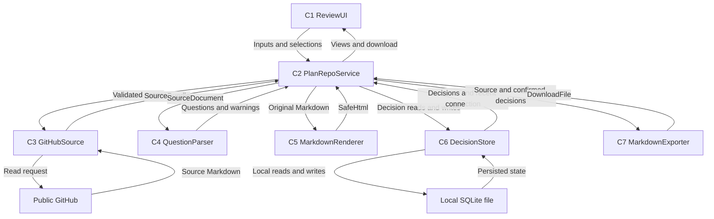

# PlanRepo 의존성과 데이터 흐름

## 직접 의존성 표

행은 호출자, 열은 호출 대상이다. `X`는 직접 호출, `-`는 직접 호출 없음이다.

| 호출자 | C1 UI | C2 Service | C3 GitHub | C4 Parser | C5 Renderer | C6 Store | C7 Exporter |
| --- | --- | --- | --- | --- | --- | --- | --- |
| C1 UI | - | X | - | - | - | - | - |
| C2 Service | - | - | X | X | X | X | X |
| C3 GitHub | - | - | - | - | - | - | - |
| C4 Parser | - | - | - | - | - | - | - |
| C5 Renderer | - | - | - | - | - | - | - |
| C6 Store | - | - | - | - | - | - | - |
| C7 Exporter | - | - | - | - | - | - | - |

C3만 외부 GitHub에 읽기 요청을 보내고 C6만 SQLite에 접근한다. C7은 C4를 직접 호출하지 않고 C2가 전달하는 ParseResult를 사용한다. 공통 데이터 타입은 특정 UI·저장 모듈에 의존하지 않는다.

## 통신 방식

- C1 ↔ C2: 브라우저와 로컬 앱 사이의 요청·응답. 구체적인 HTTP 경로와 형식은 스택 선택 후 확정한다.
- C2 ↔ C3~C7: 같은 프로세스의 함수 호출과 결과 반환. 네트워크·DB 작업의 실제 비동기 문법은 언어 선택에 따른다.
- C3 ↔ GitHub: 허용된 GitHub 읽기 경로만 사용하는 요청·응답. 토큰을 수집하지 않는다.
- C6 ↔ SQLite: 로컬 파일 읽기·쓰기, 답변 일괄 확정은 트랜잭션으로 처리한다.

## 데이터 흐름도

화살표는 데이터가 이동하는 방향이다. 외부 시스템과 SQLite를 제외한 C2~C7은 로컬 앱 프로세스 안에 있다.

### 텍스트 대안

연결 입력은 UI → Service → GitHubSource → GitHub 순서로 전달된다. 원문은 역방향으로 돌아와 Service → Parser의 질문 추출과 Service → Renderer의 열람에 사용된다. Service ↔ Store ↔ SQLite가 최근 연결과 확정 답변을 유지한다. 내보내기는 Service → Exporter → Service → UI 순서로 원문과 확정 결정을 다운로드 파일로 변환한다.

## 결합과 일관성

- 직접 호출 의존성은 C1 → C2 → C3~C7 방향이며 순환하지 않는다. 데이터 흐름도의 응답 화살표는 역방향 호출 의존성을 의미하지 않는다.
- Service가 같은 ReviewContext의 원문과 파싱 결과를 사용하게 하여 렌더링·대기열·내보내기의 원문 기준을 맞춘다.
- 모든 문서의 결정 조회와 저장은 저장소·문서 범위를 포함한다. 다른 저장소의 같은 질문 번호를 같은 결정으로 취급하지 않는다.
- 테스트는 C3 읽기 경계와 C6 파일 저장을 통과하는 핵심 사용자 흐름에 집중한다. 이 설계 때문에 별도 단위 테스트 모음이나 부하 테스트를 추가하지 않는다.
