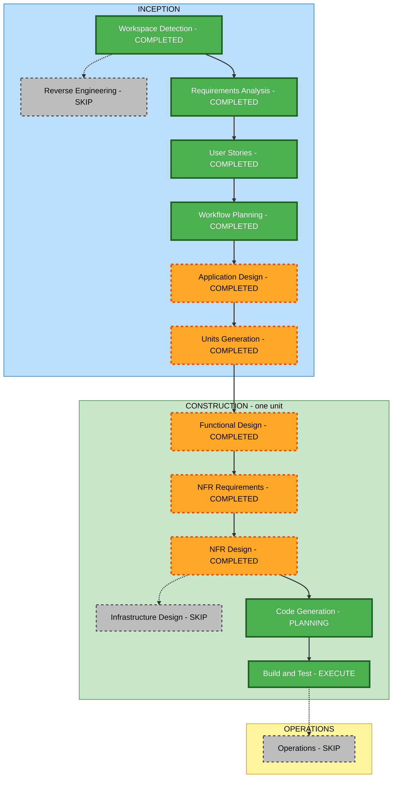

# PlanRepo MVP 실행 계획

## 현재 결정과 기준

- 상태: 2026-09-08 사용자의 다음 단계 진행 요청으로 실행 계획 승인 완료.
- User Stories 승인 근거: 직전 산출물 승인 요청에 대한 2026-09-08 사용자 재개 지시. 기존 감사 기록의 다음 단계 진행 승인 방식과 동일하게 처리했다.
- 기준: 승인된 `../requirements/requirements.md`, `../user-stories/stories.md`, `../user-stories/personas.md` 및 `story-generation-plan.md`.
- 제품: 공개 GitHub의 AI-DLC Markdown을 읽고 미결정 질문에 답한 뒤 SQLite에 저장하고 Markdown으로 내려받는 로컬 단일 사용자 웹 앱.
- 제약: 전체 MVP 1.5일, 기본 브랜치, 한 번에 저장소 하나, 외부 배포 없음, 자동 테스트는 핵심 경로 스모크 테스트만 수행.
- 제외: 인증, 비공개 저장소, GHE, 원격 쓰기, 다중 사용자, 댓글, LLM, 성능·확장성·고가용성·복원력 설계.

## 계획 작성 체크리스트

- [x] 1. 상태와 이전 승인 기록을 확인하고 요구사항·페르소나·스토리를 읽는다.
- [x] 2. 사용자 영향, 구성 요소, 데이터, 외부 연동 및 위험을 분석한다.
- [x] 3. 각 단계의 실행 여부와 상세 수준을 결정한다.
- [x] 4. 단일 구현 단위의 작업 순서와 스모크 검증 지점을 정의한다.
- [x] 5. 워크플로 도식과 텍스트 대안을 작성하고 파일 생성 전 구문을 검증한다.
- [x] 6. 상태 파일 및 감사 기록에 산출물 작성과 승인 대기를 반영한다.
- [x] 7. 실행 계획에 대한 사용자 승인을 기록하고 Application Design으로 이동한다.

## 범위와 영향 분석

| 영역 | 영향과 처리 범위 |
| --- | --- |
| 사용자 화면 | 저장소·폴더 연결, 문서 목록·뷰어, 미결정 대기열, 답변 일괄 확정, 문서별 다운로드를 신규 구현한다. |
| 구조 | 로컬 웹 앱 하나에 GitHub 읽기, 파싱, 저장 및 내보내기 책임을 구분한다. 별도 서비스나 배포 단위로 분리하지 않는다. |
| 데이터 | 최근 연결 정보, 문서별 질문 식별자, 선택 답변, 결정 시각을 SQLite에 저장한다. |
| API와 외부 연동 | 공개 GitHub 읽기 연동과 UI에서 로컬 애플리케이션 기능을 호출하는 경계를 정의한다. 공개 서비스 API 제공은 범위 밖이다. |
| 비기능 요구사항 | 단일 명령 로컬 실행, 재시작 후 데이터 유지, 입력 검증, 안전한 Markdown 렌더링 및 이해 가능한 오류만 다룬다. |
| 인프라·운영 | 로컬 프로세스와 SQLite 파일을 사용한다. 클라우드 자원, 배포 자동화, 모니터링 및 확장 정책은 만들지 않는다. |
| 기존 시스템 변경 | N/A: 소스와 빌드 설정이 없는 greenfield이므로 기존 패키지 마이그레이션이나 역공학은 필요 없다. |

### 논리 구성 요소와 연결

1. 웹 화면이 저장소·폴더 입력을 로컬 애플리케이션에 전달한다.
2. GitHub 읽기 구성 요소가 기본 브랜치의 지정 폴더 아래 Markdown을 가져온다.
3. 질문 파서가 유효한 질문·선택지·답변 위치와 경고를 만든다.
4. 답변 처리 구성 요소가 SQLite의 기존 결정을 질문에 연결하고 미결정 대기열을 만든다.
5. 사용자가 확정한 답변을 저장하고, 내보내기 구성 요소가 해당 문서의 답변 위치에 반영한다.

구체적인 메서드와 데이터 계약은 Application Design과 Functional Design에서 정의한다. 이 목록은 서비스 분리 또는 기술 스택 확정을 의미하지 않는다.

### 위험 평가

- **위험 수준: 중간**. 작은 로컬 MVP이지만 외부 문서 읽기부터 영속화·원문 반영까지 연결해야 한다.
- **되돌리기 복잡도: 낮음**. 기존 운영 시스템과 원격 파일 변경이 없으며 신규 로컬 산출물만 추가한다. 사용자 결정 데이터는 임의로 삭제하지 않는다.
- **검증 복잡도: 중간**. 연결, 파싱, 저장, 재시작 및 다운로드를 같은 경로로 확인해야 한다.

| 주요 위험 | 이번 범위의 대응 |
| --- | --- |
| GitHub 접근 실패·요청 한도 | 읽기 실패 원인을 사용자에게 표시하고 다시 시도할 수 있게 한다. 별도 복원력 설계는 하지 않는다. |
| 잘못된 질문 형식 | 문제 영역 경고와 유효 질문 처리를 함께 지원한다. 코드 예시를 실제 질문으로 잘못 추출하지 않도록 파서 경계를 설계한다. |
| 문서 재조회 시 답변 오연결 | 저장소·문서·질문 식별 및 원문 변경 시 연결 조건을 Functional Design에서 명확히 한다. |
| 내보내기 시 원문 손상 | 해당 답변 위치를 변경하고 나머지 원문을 보존하도록 설계한다. |
| 1.5일 범위 초과 | 구현 단위 하나와 짧은 설계 산출물을 유지하고 제외 기능을 추가하지 않는다. |

## 단계별 실행 결정

현재 계획 승인 이후 실행할 단계는 7개다. Code Generation은 계획 승인과 코드 생성을 포함한 하나의 단계로 센다. 각 실행 단계의 필수 산출물은 모두 작성하되 아래 범위에 맞춰 간결하게 유지한다.

| 단계 | 결정 | 깊이 | 근거 및 산출물 범위 |
| --- | --- | --- | --- |
| Workspace Detection | 완료 | 최소 | 문서만 있는 greenfield 상태를 재확인했다. |
| Reverse Engineering | 생략 | N/A | 기존 코드가 없다. |
| Requirements Analysis | 완료 | 최소 | FR-1~FR-6, 제외 범위, 기본 실행 조건이 승인됐다. |
| User Stories | 완료 | 최소 | 페르소나 하나, 사용자 여정 스토리 5개가 승인됐다. |
| Workflow Planning | 완료, 승인됨 | 최소 | 이 문서에서 단계·의존성·완료 기준을 고정한다. |
| Application Design | 완료, 승인됨 | 최소 | 새 구성 요소의 책임, 주요 메서드, 데이터 흐름과 의존성을 정의했다. |
| Units Generation | 완료, 승인됨 | 최소 | 구성 요소와 호출 경계를 하나의 `planrepo` 구현 단위로 묶고 US-01~US-05를 매핑했다. |
| Functional Design | 완료, 승인됨 | 최소 | 질문 문법, 식별자, 결정 병합, 일괄 저장, 상태 전이, 원문 내보내기와 SQLite 모델을 정의한다. |
| NFR Requirements | 완료, 승인됨 | 최소 | 사용자 지정 TypeScript + Fastify + Vue.js를 반영한 최소 NFR·기술 스택 문서 2개를 작성했다. 성능·확장성 요구는 추가하지 않는다. |
| NFR Design | 완료, 승인됨 | 최소 | 최소 NFR 9개를 설계 패턴 8개와 C1~C7·스모크 흐름에 연결한 문서 2개를 작성했다. |
| Infrastructure Design | 생략 | N/A | 외부 배포·클라우드 자원 없이 로컬 실행만 필요하다. 실행 설정과 SQLite 위치는 구현·실행 안내에서 정의한다. |
| Code Generation | 상세 계획 작성·검증 완료, 승인 대기 | 최소 | 19단계 계획에 실제 경로·API·스키마·실행·스모크를 명시했다. 전체 계획 승인 후 코드 생성한다. |
| Build and Test | 실행 | 핵심 경로 한정 | 빌드·실행 및 통합된 스모크 경로를 검증한다. 해당하지 않는 테스트 안내는 N/A와 근거만 기록한다. |
| Operations | 생략 | N/A | 현재 워크플로에서 placeholder이며 이번 MVP는 배포를 제외한다. |

NFR 단계는 이미 승인된 실행성과 최소 보안 조건을 구체화하기 위한 것이다. 비활성 확장을 다시 켜거나 부하·고가용성 설계를 추가하지 않는다.

## 워크플로 시각화

실선은 실행 순서, 점선은 생략 단계다. 초록은 완료 또는 필수 실행, 주황은 선택 실행, 회색은 생략이다. WP는 사용자 승인 완료 상태다.

### 텍스트 대안

- INCEPTION: Workspace Detection 완료 → Requirements Analysis 완료 → User Stories 완료 → Workflow Planning 완료 → Application Design 완료 → Units Generation 완료.
- CONSTRUCTION, `planrepo` 단위: Functional Design 완료 → NFR Requirements 완료 → NFR Design 완료 → Code Generation 계획 작성·승인 및 구현 → Build and Test.
- 생략: Reverse Engineering, Infrastructure Design, Operations.
- 각 단계의 규정된 승인 지점을 지키며, 이미 승인받은 사항은 다시 묻지 않는다.

## 구현 순서와 검증 지점

별도 패키지 변경 순서는 N/A다. Application Design에서 경계를 확정하고, Code Generation 계획에서 다음 순서를 구체적인 파일·체크박스로 전환한다.

| 순서 | 작업 | 요구사항·스토리 | 확인 지점 |
| --- | --- | --- | --- |
| 1 | 단일 명령 실행 골격 및 SQLite 저장 초기화 | FR-6, US-04 | 앱 시작과 파일 기반 DB 사용 |
| 2 | 공개 저장소·폴더 연결 및 문서 탐색 | FR-1, FR-2, US-01, US-02 | 문서 목록·본문과 읽기 오류 표시 |
| 3 | 질문 파싱 및 미결정 대기열 | FR-3, FR-4, US-03 | 빈 답변만 대기열에 표시, 유효 질문과 경고 공존 |
| 4 | 답변 선택·일괄 확정·재조회 연결 | FR-4~FR-6, US-04 | 결정 시각·답변·최근 연결 저장과 재시작 후 유지 |
| 5 | 문서별 Markdown 내보내기 | FR-5, FR-6, US-05 | 답변 반영, 원문 보존, 재파싱 시 결정 완료 |
| 6 | 실행 안내와 핵심 경로 스모크 검증 | 전체 | 새 실행 환경에서 시작하여 다운로드까지 확인 |

단일 앱과 데이터 계약의 연결을 유지하기 위해 순차 구현한다. 멀티 에이전트 작업은 계획하지 않는다.

## 검증 범위와 성공 기준

- [ ] 공개 GitHub 저장소의 기본 브랜치와 지정 폴더 아래 Markdown 목록·본문을 읽는다.
- [ ] 질문과 선택지를 추출하고 미결정 항목을 문서 정보와 함께 표시한다.
- [ ] 질문 여러 개의 선택 답변을 한 번에 확정하고 SQLite에 저장한다.
- [ ] 앱 재시작과 동일 문서 재조회 후 답변 및 최근 연결 정보가 유지된다.
- [ ] 저장한 답변을 해당 Markdown 위치에 반영하여 내려받고 다시 파싱할 수 있다.
- [ ] 원격 저장소는 읽기 전용이며, 입력 호스트 제한과 안전한 Markdown 렌더링을 확인한다.
- [ ] 실행 안내의 단일 명령이 동작하고 핵심 경로 스모크 테스트가 통과한다.

위 항목은 향후 구현 검증 기준이며 현재 통과를 주장하지 않는다. 자동화는 위 흐름을 묶은 소수의 스모크 테스트로 제한한다. 성능·부하·속성 기반·고가용성 테스트 및 별도 광범위한 보안 테스트는 실행하지 않는다. 원격 연결을 확인하지 못한 경우 fixture 결과와 실제 GitHub 확인 결과를 구분해 기록한다.

## 시간 배분

1.5일 전체 timebox 안에서 남은 일정을 다음 비중으로 배분한다. 아래 수치는 작업 배분 목표이며 완료 보장은 아니다.

| 작업 | 남은 작업 시간 비중 |
| --- | --- |
| 간결한 설계와 코드 생성 계획 | 20% |
| 구현과 사용자 흐름 연결 | 60% |
| 스모크 검증, 수정 및 실행 안내 | 20% |

## 확장 규칙 준수 요약

| 확장 | Enabled | 규칙별 적용 결과 | 근거 |
| --- | --- | --- | --- |
| Security Baseline | No | 전체 규칙 N/A | Requirements Analysis에서 비활성으로 승인. 전체 규칙 파일 미로드·미적용. FR-2와 최소 보안 요구는 별도로 유지. |
| Property-Based Testing | No | 전체 규칙 N/A | 스모크 테스트만 수행하도록 승인. 전체 규칙 파일 미로드·미적용. |
| Resiliency Baseline | No | 전체 규칙 N/A | 복원력·성능·확장성·고가용성 설계 제외. 전체 규칙 파일 미로드·미적용. |

활성 확장이 없으므로 확장 규칙 차단 항목은 없다. 이 결과는 구현 보안이나 품질 검증 완료를 의미하지 않는다.

## 검토와 다음 단계

사용자는 실행 계획의 수정, 생략 단계의 추가 또는 실행 단계의 제외를 요청할 수 있다. 2026-09-08 후속 요청 “다음단계로 진행해줘.”로 실행 계획이 승인되어 **Application Design**을 시작했다. 새로운 단계의 산출물 승인은 해당 단계 완료 시 받는다.
